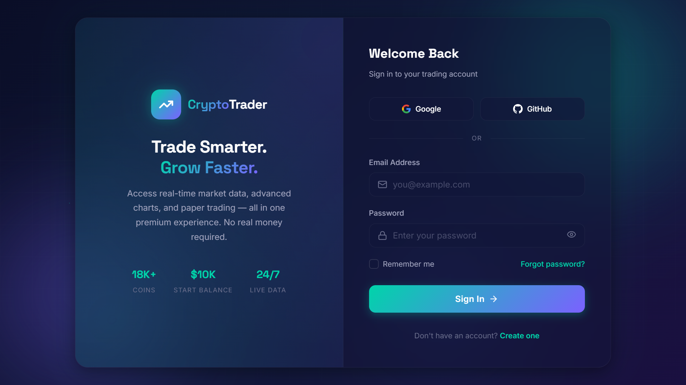
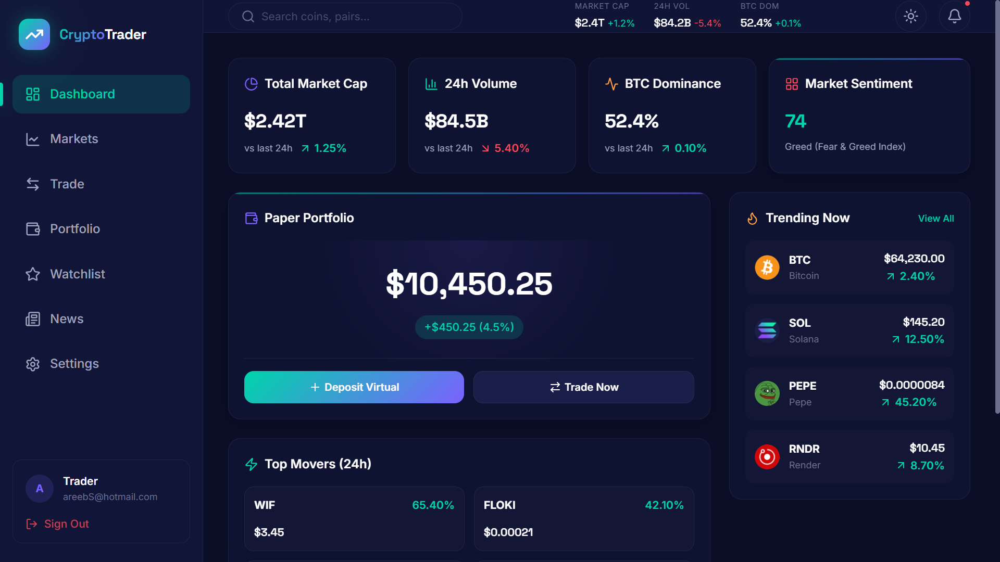

# 🪙 CryptoTrader — Live Market Dashboard & Paper Trading Simulator

**CryptoTrader** is a premium, real-time cryptocurrency dashboard and paper trading simulator built with React 19, Vite 8, and modern web APIs. Designed with a sleek, glassmorphic dark-mode interface, it allows users to monitor the crypto market, view interactive charting data, customize a personal watchlist, and simulate cryptocurrency trades with virtual funds.

---

## 📷 Screenshots

| Login Page | Dashboard |
| --- | --- |
|  |  |

---

## ✨ Features

- **📊 Live Market Insights**: Retrieve real-time metrics including total market cap, trading volumes, and trending coins powered by the **CoinGecko API**.
- **📈 Advanced Interactive Charts**: High-performance candlestick and line charting using TradingView's **Lightweight Charts** library. Easily toggle charting intervals (e.g., 1 day, 7 days, 30 days).
- **💸 Paper Trading Simulator**: Execute buy and sell orders at live market rates. Start with a default virtual balance of **$10,000 USD** and practice risk-free trading.
- **💼 Portfolio Tracker**: Keep track of current holdings, purchase history, average buy-in price, and net assets. All states are stored locally.
- **⭐ Personalized Watchlist**: Save and monitor your favorite coins directly in your interface.
- **✨ Premium UI & UX**: Fully responsive layouts featuring smooth page transitions and micro-interactions powered by **Framer Motion**, standard **Lucide React** icons, and responsive side/bottom navigation for mobile devices.
- **🔒 Simulated Authentication**: Practice logging in with simulated session expiry times (30 minutes) persisted safely in your browser.

---

## 🛠️ Tech Stack

### Core Technologies
- **Framework**: [React 19](https://react.dev/)
- **Build Tool**: [Vite 8](https://vite.dev/)
- **Language**: JavaScript (ES6+)

### Libraries & Dependencies
- **State Management**: [Zustand](https://github.com/pmndrs/zustand) (with `persist` middleware for persistent storage in `localStorage`)
- **Data Fetching**: [@tanstack/react-query](https://tanstack.com/query/latest) (handling caching, automatic retries, loading and error boundaries)
- **Routing**: [React Router DOM v7](https://reactrouter.com/)
- **Animations**: [Framer Motion](https://www.framer.com/motion/)
- **Charts**: [Lightweight Charts](https://www.tradingview.com/lightweight-charts/) (by TradingView)
- **Icons**: [Lucide React](https://lucide.dev/)

---

## 🚀 Getting Started

To run the application locally on your machine, follow these instructions:

### Prerequisites
Make sure you have **Node.js** (v18 or higher) and **npm** installed on your system.

### Installation

1. **Clone the repository**:
   ```bash
   git clone <your-repo-url>
   cd cryptoapp
   ```

2. **Install dependencies**:
   ```bash
   npm install
   ```

3. **Start the development server**:
   ```bash
   npm run dev
   ```
   Open your browser and navigate to `http://localhost:5173` (or the port specified in your console).

### Available Commands
- `npm run dev`: Starts the Vite development server with Hot Module Replacement (HMR).
- `npm run build`: Compiles the application into static production assets.
- `npm run lint`: Performs lint checks on the codebase using ESLint.
- `npm run preview`: Previews the locally built production bundle.

---

## ⚡ API Rate Limiting

The app uses the **CoinGecko Free API** to retrieve live market values. 
> [!WARNING]
> CoinGecko's free tier has a rate limit of approximately **10 to 30 requests per minute**. If you query pages rapidly, you might encounter a `429 Too Many Requests` state. The application features built-in error alerts requesting you to wait a minute before refreshing.

---

## 📂 Project Structure

```text
src/
├── api/             # CoinGecko API client & endpoints
├── assets/          # Static media and design assets
├── components/      # Reusable components
│   ├── charts/      # Financial candlestick charts
│   ├── dashboard/   # Dashboard page components
│   ├── layout/      # Sidebar, Header, and Navigation
│   └── ui/          # Reusable aesthetic UI components (GlassCard, PriceChange)
├── hooks/           # Custom React hooks (market data queries)
├── pages/           # Page components (Dashboard, Markets, Detail, Trade, Portfolio)
├── stores/          # Zustand stores (Portfolio & Watchlist local state)
├── styles/          # Custom CSS stylesheets (Glassmorphism & themes)
├── App.jsx          # Route configuration & global layouts
└── main.jsx         # Application entry point
```
